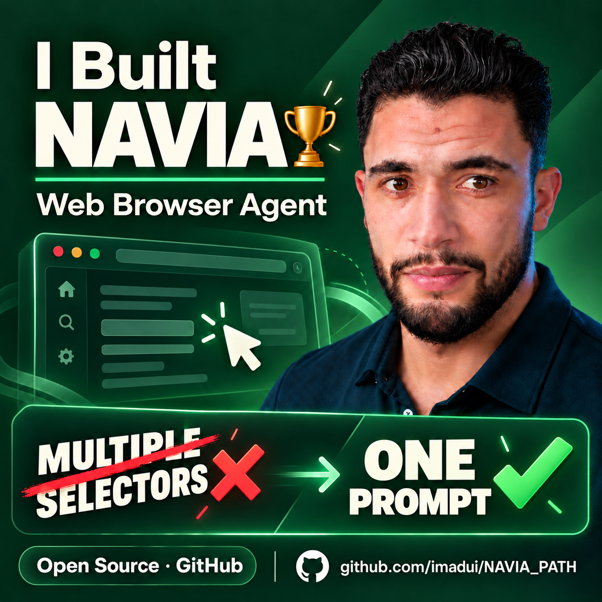

# NAVIA: UI Automation Agent

[](https://www.python.org/)
[](https://playwright.dev/)
[]()
[]()

**Python-based AI browser agent that turns a single "PROMPT" into multi-step web automation.**

- Built with Python and Playwright, with reusable UiPath activities for Chrome and Edge.
- Model-agnostic architecture supporting compatible models across OpenAI, Azure OpenAI, Anthropic, Google Gemini and Vertex AI.

---

<p align="center">
  <a href="docs/NAVIA_DEMO.mp4">
    
  </a>
  <br>
  <a href="docs/NAVIA_DEMO.mp4">▶️ Watch the demo</a>
</p>

---

## Key Highlights

- **Standalone & Autonomous**: Packaged as a single Windows x64 executable (`NAVIA_PATH.exe`). No external Python runtime, pip dependencies, or virtual environment required on user machines.
- **Ready-to-Use UiPath Integration**: Ships with the `NAVIA_PATH.Activities` library (`NAVIA PATH - Edge`, `NAVIA PATH - Chrome`) for native UiPath Studio workflows.
- **Multi-Provider Architecture**: Native support for **Google Vertex AI**, **Google Gemini Direct API**, **OpenAI**, **Anthropic Claude**, and **Azure OpenAI Service**.
- **External Configuration**: Credentials, endpoints, models, and timeouts are fully configured outside the binary via isolated `.env.<provider>` files.
- **Persistent Sessions**: User session cookies and profiles are maintained automatically in `%LOCALAPPDATA%\NAVIA_PATH`.
- **Integrated Health Diagnostics**: Instant environment and credentials validation via `NAVIA_PATH.exe --check`.

---

## Quick Start

1. **Extract** the release archive (`NAVIA_PATH-v1.1.2-windows-x64.zip`) into your target folder (e.g., `C:\NAVIA_PATH`).
2. **Choose your LLM provider** and create your configuration file in `config\providers\` (e.g., copy `.env.vertex.example` to `.env.vertex`).
3. **Run the pre-flight check**:
   ```powershell
   .\NAVIA_PATH.exe --check
   ```
4. **Execute your first prompt**:
   ```powershell
   .\NAVIA_PATH.exe --prompt "Navigate to the internal portal and extract order status"
   ```

For a detailed step-by-step walkthrough, see **[QUICKSTART.md](QUICKSTART.md)**.  
For provider-specific configuration guides, see **[PREPARE_LLM_ENVIRONMENTS.txt](PREPARE_LLM_ENVIRONMENTS.txt)**.

---

## Supported Providers

| Provider | Default Model | Authentication Mechanism |
| :--- | :--- | :--- |
| **Google Vertex AI** *(Default)* | Gemini 3.8 Flash | Application Default Credentials (`gcloud auth application-default login`) |
| **Google Gemini Direct** | Gemini 2.5 Flash | API Key (`GEMINI_API_KEY`) |
| **OpenAI** | GPT-4o | API Key (`OPENAI_API_KEY`) |
| **Anthropic Claude** | Claude 3.5 Sonnet | API Key (`ANTHROPIC_API_KEY`) |
| **Azure OpenAI** | GPT-4o *(deployment)* | Endpoint & API Key (`AZURE_OPENAI_API_KEY`) |

---

## UiPath Integration

The distribution includes the ready-to-import activity project in `uipath\NAVIA_PATH.Activities`:
- **`NAVIA PATH - Edge`**: Automates a persistent Microsoft Edge session.
- **`NAVIA PATH - Chrome`**: Automates a persistent Google Chrome session.

The activities dynamically discover `NAVIA_PATH.exe`, ensure debugging prerequisites, run synchronously without background console windows, and populate `out_ExecutionResult` with structured JSON data.

---

## CLI Reference

```text
NAVIA_PATH.exe [--check] [--version] [run] [OPTIONS]

Commands:
  check                     Verify configuration and runtime environment
  run                       Execute the agent on a user prompt

Options:
  --prompt TEXT             Task objective in plain text
  --prompt-base64 B64       Task objective encoded in base64
  --max-iterations INT      Maximum iteration limit (default: 20)
  --result-file PATH        Path to JSON result output file
  --close-browser BOOL      Close browser upon completion (true/false)
  --require-attached-browser BOOL
                            Require strict attachment to existing debug browser
  --browser CHANNEL         Target browser channel: msedge or chrome
  --check                   Quick health and configuration check
  --version, -v             Display version information
```

---

## License

This project is licensed under the MIT License - see the **[LICENSE](LICENSE)** file for details.
